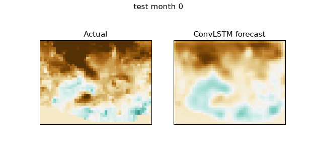

# Forecasting Drought Propagation in the U.S. Southwest with Spatiotemporal Deep Learning

## Technical Report

A full technical report for this project is available here:

- [PDF Report](report/drought_convlstm_technical_report.pdf)
- [Markdown Report](report/drought_convlstm_technical_report.md)

The report documents the data pipeline, ConvLSTM and pixel-wise LSTM baselines, chronological evaluation design, lead-time experiment, limitations, and reproducibility steps.

---

A **ConvLSTM** that forecasts monthly drought fields over the U.S. Southwest from
gridMET SPI, benchmarked against persistence, climatology, and a per-pixel LSTM
to isolate **where spatial coupling actually helps** — with a multi-month
lead-time analysis. Trained and evaluated on real gridMET data (1990–2024).

<sub>PyTorch · gridMET SPI-3/6/12 · ConvLSTM · spatiotemporal forecasting · leakage-safe evaluation · run on ASU's Sol supercomputer</sub>

---

## 1. Motivation

Operational drought outlooks and many ML studies forecast each location
independently. But drought is a **spatial process**: deficits propagate across a
basin as anomalies advect and persist. A per-pixel model is structurally blind
to a drought front arriving from a neighboring region.

> **Research question.** Does a model that ingests the *full drought-index field*
> (ConvLSTM) forecast drought better than persistence, climatology, and a
> per-pixel LSTM with no spatial coupling — and **where**, specifically, does
> spatial structure add skill?

The honest answer this project arrives at is more useful than "deep learning
wins": spatial coupling does **not** improve bulk forecast accuracy at monthly,
~16 km resolution, but it **substantially improves drought-onset prediction**,
and that advantage **grows with lead time**.

This extends my geospatial drought research with Dr. Margaret Garcia (SPI / SRI /
SSMI indicators, raster climate pipelines) from analysis into forecasting.

---

## 2. Results (real gridMET data, U.S. Southwest, 1990–2024)

### 2.1 Both deep models beat the baselines; ConvLSTM ≈ pixel-LSTM on bulk accuracy

One-month-ahead forecast on the held-out test period:

| model | RMSE | skill vs persist | onset F1 | onset recall |
|---|---:|---:|---:|---:|
| persistence | 0.826 | 0.000 | 0.000 | 0.000 |
| climatology | 1.159 | −0.969 | 0.000 | 0.000 |
| **pixel_lstm** | **0.694** | **0.295** | 0.216 | 0.141 |
| convlstm | 0.715 | 0.250 | **0.231** | **0.159** |

Both learned models crush persistence and climatology — the baselines score
**zero** on drought-onset detection. On bulk error the per-pixel LSTM is
marginally ahead, so spatial coupling does not buy general accuracy here. The
ConvLSTM's edge is confined to **drought onset** (F1 0.231 vs 0.216, recall
0.159 vs 0.141) — the operationally important case of anticipating a region
*entering* drought.

### 2.2 The spatial advantage is in onset detection — and it widens with lead time


Left: both models gain skill over persistence as the horizon lengthens (≈ 0.26 at
one month to ≈ 0.58 at six months), and on this metric they track each other.
Right is the real story — **the ConvLSTM detects drought onset better than the
per-pixel LSTM at every lead, and the gap widens**:

| lead (months) | 1 | 2 | 3 | 4 | 5 | 6 |
|---|---:|---:|---:|---:|---:|---:|
| ConvLSTM onset F1 | 0.217 | 0.103 | 0.088 | 0.133 | 0.136 | **0.148** |
| Pixel-LSTM onset F1 | 0.188 | 0.093 | 0.040 | 0.038 | 0.045 | **0.056** |

The per-pixel model's onset skill collapses toward ~0.05 past the first month
while the ConvLSTM recovers and holds ~0.13–0.15. Spatial context is what lets the
model keep anticipating *new* drought as the forecast reaches further out — and
climatology never predicts a single onset (F1 = 0 at every lead).

### 2.3 Forecast fields and animated propagation


The ConvLSTM produces smooth, coherent drought fields (brown = dry); persistence
just copies the previous month. (The flat lower-left wedge is the edge of
gridMET's CONUS coverage — those out-of-domain cells should be masked; see §6.)



---

## 3. Data

| | |
|---|---|
| **Source** | gridMET (Abatzoglou 2013), 4 km CONUS daily precipitation, via OPeNDAP |
| **Indices** | SPI-3, SPI-6, SPI-12 (gamma-fit, standardized) via the NIDIS `climate_indices` package |
| **Domain** | U.S. Southwest box (lat 31–37, lon −115 to −107), 1990–2024, monthly |
| **Grid** | spatially coarsened (~16 km) to keep training tractable on one node |

---

## 4. Method

Feed `seq_len` past monthly SPI fields, predict the next field; for the lead-time
study the model is rolled forward **autoregressively**.

- **ConvLSTM** (Shi et al. 2015) — convolutional gates make the recurrent state a
  spatial field, so it learns local advection and persistence.
- **Per-pixel LSTM** — identical temporal capacity, **no** spatial information;
  the control that isolates the value of spatial modeling.
- **Persistence / climatology** — the bars any useful forecast must clear.

---

## 5. Experimental design (leakage-safe)

Strict chronological split (no shuffling; windows never straddle the boundary),
per-pixel standardization fit on the **training period only**, fixed seeds, and
config-driven runs with saved checkpoints and metrics. Evaluation reports RMSE,
MAE, **skill vs persistence**, anomaly correlation, and **drought-onset F1 /
recall** (predicting a pixel crossing SPI < −0.8, ~ D1, next month).

---

## 6. Limitations & future work

The Southwest box clips gridMET's CONUS coverage, so edge cells appear as flat
artifacts and should be masked. Results are single-resolution, monthly, and
deterministic. Planned next steps: mask out-of-domain cells, a **region-holdout**
test of spatial generalization (the script is included — `src/region_holdout.py`),
a probabilistic head for forecast uncertainty, validation against independent
**U.S. Drought Monitor** categories, and adding ENSO indices as exogenous drivers.

---

## 7. Reproduce

```bash
pip install -r requirements.txt

# fast synthetic pipeline check (no data download)
python src/train.py --config config_demo.yaml
python src/evaluate.py --config config_demo.yaml

# real run (needs gridMET access; runs on a single CPU/GPU node)
python src/train.py          --config config.yaml
python src/evaluate.py       --config config.yaml
python src/leadtime.py       --config config.yaml --max_lead 6
python src/visualize.py      --config config.yaml
python src/region_holdout.py --config config.yaml   # optional
```

A synthetic drought-field generator (`src/synth.py`) is included so the full
pipeline can be verified without climate-server access.

---

## 8. Repository structure

```
src/
  synth.py           synthetic drought-field generator (pipeline check)
  data.py            gridMET download + SPI-3/6/12 + windowing + chronological split
  models.py          ConvLSTM forecaster + per-pixel LSTM baseline
  train.py           training (ConvLSTM and baseline)
  evaluate.py        metrics, skill scores, onset detection vs baselines
  leadtime.py        autoregressive multi-month skill-vs-lead analysis
  region_holdout.py  spatial generalization experiment
  visualize.py       comparison panels + propagation GIF
config.yaml          real gridMET configuration (US Southwest)
config_demo.yaml     fast synthetic configuration
assets/figures/      figures in this README (from the real run)
results/             metrics.json from the real run
```

---

## References

- Shi et al. (2015), *Convolutional LSTM Network*, NeurIPS.
- Abatzoglou (2013), *gridMET*, Int. J. Climatology.
- McKee et al. (1993), SPI. NIDIS `climate_indices` package.

<sub>Independent extension of drought-propagation research at Arizona State University. Computation performed on ASU Research Computing's Sol supercomputer.</sub>

