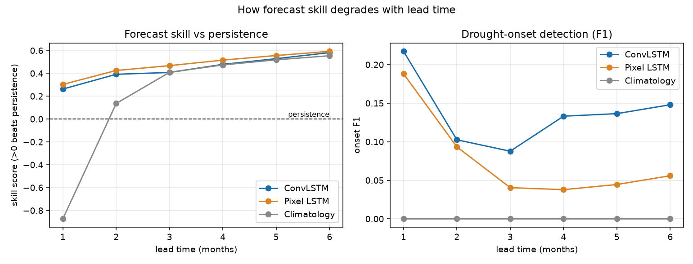
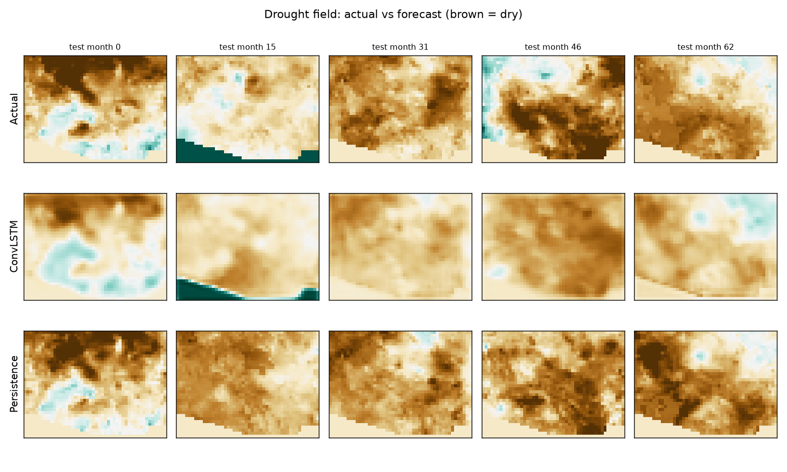

# Forecasting Drought Propagation in the U.S. Southwest with Spatiotemporal Deep Learning

**Tejas Sharma**
Computer Science, Arizona State University

---

## Abstract

Drought indices do not evolve independently at each location: moisture deficits build up and move across a region as anomalies persist and advect from neighboring areas. Most forecasting setups, including many machine-learning ones, predict each grid cell on its own and cannot represent this spatial coupling. This project tests whether a model that observes the full drought-index field forecasts monthly drought conditions better than a model with no spatial information. Using gridMET precipitation (1990–2024) to derive SPI-3, SPI-6, and SPI-12 fields over a U.S. Southwest domain (lat 31–37, lon −115 to −107), I trained a ConvLSTM and a per-pixel LSTM baseline to predict the next month's field from six months of history, and compared both against persistence and climatology under a strict chronological train/validation/test split. On one-month-ahead test metrics, the per-pixel LSTM has marginally lower RMSE than the ConvLSTM (0.694 vs. 0.715), but the ConvLSTM detects drought onset more reliably (F1 0.231 vs. 0.216, recall 0.159 vs. 0.141), and this gap widens substantially once both models are rolled forward autoregressively to longer lead times. The results indicate that, in this setup, spatial context does not improve bulk field reconstruction but does help identify where drought conditions newly emerge — the part of the forecast most relevant to early-warning use.

---

## 1. Introduction

Drought is usually described with single-point indices — the Standardized Precipitation Index (SPI) at a station or a single grid cell — but the underlying process is spatial. A precipitation deficit over one part of a basin tends to be associated with deficits nearby, and dry conditions can persist and shift across a region from one month to the next rather than appearing independently at every location. A forecasting model that only looks at a location's own history has no way to use information about what is happening next door.

Most operational drought outlooks and a fair amount of the machine-learning drought literature treat each grid cell as its own forecasting problem. This is a reasonable simplification, but it throws away information about spatial structure. The question this project asks is narrow and testable:

> **Research question.** Does a model that ingests the full drought-index field (a ConvLSTM) forecast drought better than a model that treats every location independently (a per-pixel LSTM), and does that depend on which metric is used to evaluate "better"?

To answer this I built a small, self-contained forecasting pipeline: download gridMET precipitation, derive multi-scale SPI fields, train a spatiotemporal model (ConvLSTM) and a temporal-only baseline (per-pixel LSTM) with identical training data and a comparable amount of model capacity, and evaluate both against the standard no-skill baselines (persistence and climatology). The same harness also rolls the learned models forward autoregressively to see how their advantage (or disadvantage) changes as the forecast horizon lengthens from one to six months.

This project is an independent extension of earlier coursework and research-assistant work on geospatial drought indicators (SPI, SRI, and SSMI raster pipelines) at Arizona State University; that prior work was descriptive and diagnostic, while this project moves the same kind of data into a forecasting setting. The forecasting pipeline itself was designed, implemented, and run independently for this project.

---

## 2. Data and Study Region

**Source.** Precipitation comes from gridMET (Abatzoglou, 2013), a daily, ~4 km gridded meteorological dataset covering the contiguous United States. The data pipeline (`src/data.py`) pulls daily precipitation over the configured bounding box and date range via OPeNDAP from the gridMET THREDDS server, then resamples it to monthly totals.

**Domain and period.** The study domain is a bounding box over the U.S. Southwest, lat 31–37°N, lon −115 to −107°W, which covers most of Arizona, New Mexico, and a strip of southern Nevada and Utah. The time range is January 1990 through December 2024 (35 years, 420 months).

**Drought indices.** From the monthly precipitation totals, the pipeline derives the Standardized Precipitation Index (SPI; McKee et al., 1993) at three accumulation scales — SPI-3, SPI-6, and SPI-12 — using a gamma-distribution fit computed with the `climate_indices` package maintained under NIDIS. These three fields are stacked as three input channels at every grid cell and time step, in that fixed order (channel 0 = SPI-3, channel 1 = SPI-6, channel 2 = SPI-12). SPI is used because it only requires precipitation, which keeps the data pipeline self-contained; no temperature, soil moisture, or evapotranspiration inputs are used.

**Spatial coarsening.** gridMET's native resolution (roughly 4 km, 1/24°) is too fine to train on directly at this domain size and channel count on a single machine, so the pipeline spatially coarsens the precipitation field before computing SPI, averaging blocks of cells together (`xarray`'s `coarsen`, with a default factor of 4 in `src/data.py`). `config.yaml` does not override this default, so the real-data run uses a coarsening factor of 4, which the README describes as producing an effective resolution of roughly 16 km. Given the bounding box size and gridMET's nominal native resolution, this would put the native grid at approximately 144 × 192 cells and the coarsened grid at roughly 36 × 48 cells; the repository does not log the exact post-coarsening array shape from a specific run, so these numbers should be read as an estimate from the configuration rather than a value pulled directly from saved output.

**Train/validation/test split.** The 420-month record is split chronologically — never shuffled, and no input window is allowed to straddle a split boundary — into 70% training, 15% validation, and 15% test (`chronological_splits` in `src/data.py`). `config.yaml`'s own comments describe this as corresponding to roughly training through 2013, validation 2014–2017, and test 2018–2024; this is the project's documented approximation of the split rather than a value independently re-derived for this report. Per-pixel, per-channel standardization (subtract mean, divide by standard deviation) is fit using only the training period and then applied to validation and test data, which avoids leaking future statistics into the evaluation. Grid cells with no valid precipitation record (for example, areas inside the bounding box but outside gridMET's CONUS coverage) are set to zero after standardization rather than dropped, which leaves a visible flat region at the edge of some figures (Section 5.3).

---

## 3. Methods

### 3.1 Problem Formulation

The forecasting task is next-step field prediction: given `seq_len = 6` months of past 3-channel SPI fields over the H×W grid, predict the 3-channel field for the following month. Models are trained with mean squared error over all three SPI channels jointly. All of the evaluation metrics reported in Section 4, however, are computed only on channel 0 (SPI-3) — this is how `src/evaluate.py` and `src/leadtime.py` are written, and it means the headline numbers in this report describe SPI-3 forecast skill specifically. SPI-6 and SPI-12 are predicted by the same models but are not separately scored here.

### 3.2 ConvLSTM Model

The spatiotemporal model (`ConvLSTMForecaster` in `src/models.py`) follows Shi et al. (2015): each recurrent cell replaces the fully-connected gates of a standard LSTM with a single 3×3 convolution (padding 1, so spatial dimensions are preserved) that takes the concatenation of the current input field and the previous hidden state and produces the four LSTM gates (input, forget, output, candidate) as feature maps. The hidden and cell states are themselves spatial fields rather than vectors, so information can mix across neighboring grid cells at every time step. The real-data configuration stacks two such layers with 48 hidden channels each; after the six-step sequence is processed, a 1×1 convolution maps the final hidden state back down to 3 channels to produce the next-month field.

### 3.3 Pixel-wise LSTM Baseline

The control model (`PixelLSTM`) uses an identical amount of sequence modeling but no spatial coupling at all. A single shared `torch.nn.LSTM` (96 hidden units, 2 layers in the real configuration) is applied independently to every grid cell's own 6-month, 3-channel history — implemented by reshaping the (batch, time, channel, height, width) tensor so that every pixel becomes its own sequence in the batch dimension, with the same LSTM weights applied everywhere. A linear layer maps the final hidden state back to 3 channels. Because the LSTM weights are shared across pixels, this model can learn general temporal dynamics (e.g., how SPI-3 tends to evolve given its own recent history), but by construction it cannot use information from any other pixel. This is the model whose only structural difference from the ConvLSTM is the absence of spatial mixing, which is what isolates the effect being tested.

### 3.4 Persistence and Climatology Baselines

Persistence predicts that next month's field equals this month's field; it has no parameters and needs no training. Climatology predicts the per-pixel mean field computed from the training period, repeated for every test-period prediction. Both are computed directly in `src/evaluate.py` rather than trained, and both serve as the floor that a useful model has to clear.

### 3.5 Training Procedure

Both learned models are trained with Adam (learning rate 0.001 for the real configuration), batch size 8, for 60 epochs, with `numpy` and `torch` seeded to 0. The training loss is mean squared error over all three channels. After every epoch the model is evaluated on the validation split, and the checkpoint with the lowest validation loss is kept; there is no learning-rate schedule or early stopping beyond that checkpoint selection. Training and validation loss curves are written to a history file per model but are not currently included as a committed figure in the repository.

### 3.6 Evaluation Metrics

`src/evaluate.py` reports, for every model, on the held-out test period:

- **RMSE** and **MAE** of the predicted SPI-3 field against the actual field.
- **Skill score vs. persistence**: 1 − MSE(model) / MSE(persistence); zero means the model is exactly as accurate as persistence, positive means it beats persistence, negative means it is worse.
- **Anomaly correlation**: the Pearson correlation between the predicted and actual fields after each is mean-centered. This is computed once over the flattened test set rather than as a per-time-step spatial pattern correlation averaged over time, so it should be read as a single pooled correlation statistic rather than the conventional time-averaged anomaly correlation used in some weather-forecast verification literature.
- **Drought-onset F1** and **recall**: a pixel counts as a true onset if its previous-month SPI-3 was at or above −0.8 (roughly the boundary into "moderate drought," D1, on the SPI scale) and its actual current-month SPI-3 falls below −0.8; a predicted onset uses the same rule with the model's prediction in place of the actual value. F1 and recall are then computed over all test pixels and months. Because persistence's prediction is always equal to the previous month's value, persistence can never predict an onset under this definition — its onset F1 and recall are 0.000 by construction, not because it happened to miss every transition.

### 3.7 Lead-Time Rollout Experiment

`src/leadtime.py` extends the one-month evaluation to longer horizons by rolling the ConvLSTM and pixel-LSTM forward autoregressively: each model predicts month *t*+1 from the last six observed months, that prediction is appended to the input window in place of the oldest frame, and the model predicts *t*+2, and so on up to *t*+6. This tests whether the models have learned dynamics that hold up over multiple steps, rather than a one-step correlation that only happens to look good at lead 1. At every lead, skill-vs-persistence and onset F1 are recomputed against the real ground truth for that future month; climatology's curve uses the fixed training-period mean field at every lead, and persistence is the implicit reference (skill = 0) rather than a plotted curve. Onset at every lead is defined relative to the same last truly observed field (the "origin" month immediately before the rollout begins), not relative to the model's own prediction from the previous lead step. Test-period origins that do not have six full future months available (the last five months of the test period) are excluded from this analysis so that every lead from 1 to 6 has a real ground-truth target.

---

## 4. Results

### 4.1 One-Month-Ahead Test Metrics

**Table 1.** One-month-ahead forecast metrics on the held-out test period (computed on the SPI-3 channel).

| Model | RMSE | MAE | Skill vs. Persistence | Anomaly Correlation | Onset F1 | Onset Recall |
|---|---:|---:|---:|---:|---:|---:|
| Persistence | 0.826 | 0.570 | 0.000 | 0.739 | 0.000 | 0.000 |
| Climatology | 1.159 | 0.930 | −0.969 | 0.047 | 0.000 | 0.000 |
| Pixel-LSTM | **0.694** | **0.513** | **0.295** | **0.802** | 0.216 | 0.141 |
| ConvLSTM | 0.715 | 0.533 | 0.250 | 0.783 | **0.231** | **0.159** |

Both learned models clear the baselines by a wide margin: climatology, which ignores the current state of the field entirely, is worse than persistence on every error metric (skill score −0.969) and has close to zero anomaly correlation, which is expected since a constant per-pixel mean field has no month-to-month variation to correlate with anything. Persistence itself is a fairly strong reference at one month — its anomaly correlation (0.739) is not far behind the learned models — which is typical for indices like SPI-3 that already carry a lot of month-to-month autocorrelation.

Between the two learned models, the per-pixel LSTM has the lower RMSE and MAE, so under this evaluation spatial coupling does not improve bulk one-month field accuracy. The ConvLSTM's advantage is specific to onset detection: F1 of 0.231 vs. 0.216 and recall of 0.159 vs. 0.141. Both onset numbers are modest in absolute terms — most drought-onset transitions are still missed by both models — but the ConvLSTM identifies a noticeably larger share of them than the pixel-wise baseline. Persistence and climatology both score exactly zero on onset F1 and recall, for the structural reasons described in Section 3.6, so this metric is the one place in Table 1 where the learned models are not just incrementally better than a trivial baseline but are doing something a trivial baseline structurally cannot.

### 4.2 Skill and Onset Detection vs. Lead Time



**Figure 1.** Left: skill score vs. persistence as the autoregressive rollout is extended from 1 to 6 months. Right: drought-onset F1 over the same lead times. Notice that the two panels tell different stories about which model is "ahead."

The left panel of Figure 1 shows skill-vs-persistence climbing for every model as lead time increases — from roughly 0.26–0.30 at one month to roughly 0.55–0.59 at six months — and the ConvLSTM and pixel-LSTM track each other closely throughout, with climatology starting far behind (−0.87 at lead 1) but converging toward the same range by lead 5–6. Part of this rise is mechanical rather than a sign that any model is getting more accurate in absolute terms: persistence, the denominator in the skill score, gets worse quickly as the forecast horizon lengthens (holding the last observed month fixed becomes a progressively weaker assumption), so the bar that defines "skill = 0" drops, and any reasonable forecast looks more skillful relative to it without necessarily improving on its own.

The right panel is where the two models diverge. ConvLSTM onset F1 starts at 0.217 at lead 1, drops to 0.088 at lead 3, then recovers to 0.133–0.148 by leads 4–6. Pixel-LSTM onset F1 starts close behind at 0.188, but collapses to 0.038–0.056 for leads 3–6 and never recovers. Climatology's onset F1 is exactly 0.000 at every lead, consistent with the one-month result: its prediction never crosses the drought threshold from above, so it can never register an onset under this metric's definition.

**Table 2.** Drought-onset F1 by autoregressive lead time (months).

| Lead (months) | 1 | 2 | 3 | 4 | 5 | 6 |
|---|---:|---:|---:|---:|---:|---:|
| ConvLSTM | 0.217 | 0.103 | 0.088 | 0.133 | 0.136 | **0.148** |
| Pixel-LSTM | 0.188 | 0.093 | 0.040 | 0.038 | 0.045 | **0.056** |

The ConvLSTM holds a higher onset F1 than the pixel-LSTM at every lead in this experiment, and the absolute gap is larger at six months (0.148 vs. 0.056) than at one month (0.217 vs. 0.188). This is consistent with the one-month result in Table 1 and suggests the advantage is not a one-off; it does not, on its own, establish why the gap widens, and I treat that as a finding to interpret carefully rather than a settled mechanism (Section 5).

### 4.3 Forecast Field Comparison



**Figure 2.** Drought field comparison at five test-period months (brown = dry, green = wet, using the standard hydrology color convention). Top row: actual SPI-3. Middle row: ConvLSTM one-month forecast. Bottom row: persistence (previous month copied forward). Notice that the ConvLSTM row is visibly smoother than both the actual field and the persistence row, and that all three rows share the same flat wedge in the lower-left corner.

The ConvLSTM's predicted fields are visibly smoother and more spatially coherent than either the actual field or the persistence forecast — sharp local extremes are softened, and the broad pattern of where it is dry versus wet is preserved without the pixel-level texture seen in the real data. Persistence, by definition, reproduces the exact texture of the previous month, including any pixel-level noise that will not actually still be there next month. The flat, uniformly colored wedge in the lower-left of several panels (most visible at test month 15) is the part of the bounding box that falls outside gridMET's CONUS coverage; those cells are filled with zero during preprocessing rather than excluded, and they show up identically across all three rows since none of the models can predict data that was never meaningfully present. This area is a known artifact of the bounding-box choice and is flagged for masking in future work (Section 6).

A short animated version of this comparison (alternating actual vs. ConvLSTM forecast across all 63 test months) is included in the repository as `assets/figures/spread.gif` and is referenced here as supplementary material; it is not reproduced in this report because GIF animation does not render in a static PDF.

---

## 5. Discussion

**Why might spatial modeling help onset detection specifically?** A drought-onset transition is a threshold crossing, and the pixels nearest that threshold are exactly the ones where a small amount of noise can flip the prediction the wrong way. Averaging information from a local neighborhood — which is what a 3×3 convolution does at every layer — can reduce that noise and make the model's estimate of "is this pixel about to cross −0.8" more stable, even if it does not improve the average magnitude error everywhere. The per-pixel LSTM has no such neighborhood signal to draw on; it can only condition on a location's own past.

**Why might the pixel-LSTM still come out ahead on RMSE?** The smoothing that plausibly helps near a threshold can hurt when there is no threshold involved. If most of the test set consists of pixels well inside or well outside drought (away from the −0.8 boundary), a model that tracks each pixel's own short-term autocorrelation tightly, without blending in neighboring values, may simply produce a sharper, more locally accurate prediction on average — at the cost of being a worse predictor exactly at the boundary, where it matters for onset.

**Why might monthly resolution and this domain size limit the ConvLSTM's advantage?** SPI-6 and SPI-12, by construction, already average precipitation over long windows and are therefore smooth in time; SPI-3 is less so, but a monthly cadence still discards a lot of the sub-monthly variability that might be where spatial propagation is most informative. Separately, the coarsened grid here is on the order of a few thousand cells and the training record is a single 35-year, single-domain time series. That is a modest amount of data and spatial extent for a convolutional model to learn general propagation dynamics from, relative to the kind of multi-decade, multi-region datasets used in the precipitation-nowcasting literature that ConvLSTM was originally developed for.

**Why treat onset metrics as more important than RMSE for this use case?** A water manager or drought-outlook reader is usually less interested in "the model's average error across the whole domain" than in "did the model flag the place that is about to enter drought." Onset F1 and recall are closer to that operational question than RMSE is, even though they are computed on a smaller, harder subset of cases (most pixel-months are not transitions at all).

**What this result does and does not show.** It is evidence, from one domain, one resolution, one architecture pair, and one 35-year record, that a spatially aware model can have a measurable edge on drought-onset detection that a comparably sized temporal-only model does not, and that this edge does not show up — and may even reverse — on bulk error metrics. It does not show that ConvLSTMs are generally better drought forecasters, that this particular gap would hold at a different resolution or domain, or that the mechanism behind the gap (smoothing near a threshold, as hypothesized above) is the actual cause rather than a plausible story consistent with the numbers. A single training run with a single random seed is also not enough to rule out the result being influenced by that seed.

---

## 6. Limitations

- The Southwest bounding box clips part of gridMET's CONUS coverage, leaving a flat, uninformative region at the domain edge (Figure 2) that is currently zero-filled rather than masked out of training and evaluation.
- Spatial coarsening, monthly aggregation, and the gamma-fit SPI computation are all smoothing operations applied before the model ever sees the data; faster drought onsets or sub-monthly dynamics are not represented in this pipeline.
- All results come from a single train/validation/test split and a single random seed (0); there is no repeated-run variance estimate, so small metric differences (such as the 0.715 vs. 0.694 RMSE gap) should be read with that in mind rather than treated as guaranteed to replicate exactly under a different seed.
- The inputs are SPI-only. No ENSO indices, soil moisture, evapotranspiration, temperature, or vegetation data are included, all of which are plausible predictors of drought evolution that this pipeline does not use.
- There is no formal uncertainty quantification: both models output a single deterministic field per forecast rather than a distribution or ensemble.
- `src/region_holdout.py` is included in the repository to test whether the ConvLSTM's spatial structure generalizes to a region it was not trained on, but it has not been run for this report; no region-holdout numbers are reported here.
- The headline metrics in Section 4 are computed on the SPI-3 channel only, even though the models are trained on and produce SPI-3, SPI-6, and SPI-12 jointly; SPI-6 and SPI-12 forecast quality is not separately characterized.
- This is a research prototype built to test a specific comparison (spatial vs. non-spatial modeling) under a controlled, leakage-safe evaluation. It has not been validated against an independent drought reference such as the U.S. Drought Monitor, and it is not intended or evaluated as an operational drought-monitoring tool.

---

## 7. Reproducibility

**Repository structure**

```
src/
  synth.py           synthetic drought-field generator (pipeline check)
  data.py            gridMET download + SPI-3/6/12 + windowing + chronological split
  models.py          ConvLSTM forecaster + per-pixel LSTM baseline
  train.py           training (ConvLSTM and baseline)
  evaluate.py        metrics, skill scores, onset detection vs. baselines
  leadtime.py        autoregressive multi-month skill-vs-lead analysis
  region_holdout.py  spatial generalization experiment (not yet run for this report)
  visualize.py       comparison panels + propagation GIF
config.yaml          real gridMET configuration (U.S. Southwest)
config_demo.yaml     fast synthetic configuration
assets/figures/      figures used in this report
results/             metrics.json and leadtime.json from the real run
```

**Real-data pipeline**

```bash
pip install -r requirements.txt

python src/train.py     --config config.yaml
python src/evaluate.py  --config config.yaml
python src/leadtime.py  --config config.yaml --max_lead 6
python src/visualize.py --config config.yaml
```

This path needs network access to the gridMET THREDDS server and the `xarray` / `netCDF4` / `dask` / `climate-indices` packages, and is meant to run on a single CPU or GPU node (the real run for this report was executed on Arizona State University's Sol supercomputer).

**Synthetic pipeline check**

```bash
python src/train.py    --config config_demo.yaml
python src/evaluate.py --config config_demo.yaml
```

`src/synth.py` generates drought-like fields locally — an AR(1) process in time, smoothed in space, with an explicit negative anomaly that drifts diagonally across the grid to stand in for a propagating drought signal. This exists so the full pipeline (data windowing, both models, training loop, metrics, and onset detection) can be exercised and checked for bugs without needing climate-server access or a GPU, before committing to the longer real-data run.

---

## 8. Conclusion

This project finds that a spatiotemporal model can outperform simple baselines for monthly drought-field forecasting in the U.S. Southwest, but the picture is more specific than "deep learning wins." The per-pixel LSTM had a small edge on one-month bulk accuracy (RMSE and MAE), while the ConvLSTM showed a consistent advantage in drought-onset detection that held at every lead time tested and widened as the forecast horizon extended from one to six months. Within this setup, spatial context does not appear to help with reconstructing the next field in general, but it does appear to help with identifying where drought is newly emerging — which is closer to what an early-warning use case actually needs. This is a result from one domain, one resolution, and one pair of architectures, and should be read as evidence toward that narrower claim rather than a general statement about spatial deep learning for drought forecasting.

---

## References

- Shi, X., Chen, Z., Wang, H., Yeung, D.-Y., Wong, W.-K., & Woo, W. (2015). Convolutional LSTM Network: A Machine Learning Approach for Precipitation Nowcasting. *Advances in Neural Information Processing Systems (NeurIPS)*.
- Abatzoglou, J. T. (2013). Development of gridded surface meteorological data for ecological applications and modelling. *International Journal of Climatology*, 33(1), 121–131.
- McKee, T. B., Doesken, N. J., & Kleist, J. (1993). The relationship of drought frequency and duration to time scales. *Proceedings of the 8th Conference on Applied Climatology*, American Meteorological Society.
- National Integrated Drought Information System (NIDIS). `climate_indices` Python package, used to compute SPI from precipitation.

<sub>Independent project, Arizona State University. Real-data training and evaluation were run on ASU Research Computing's Sol supercomputer. Code, configuration, and results referenced in this report are available in the project repository.</sub>

